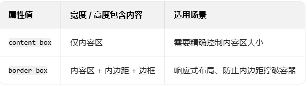
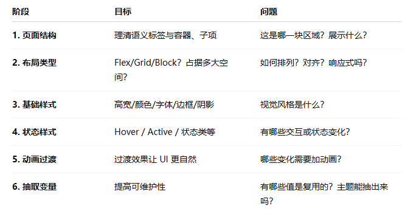
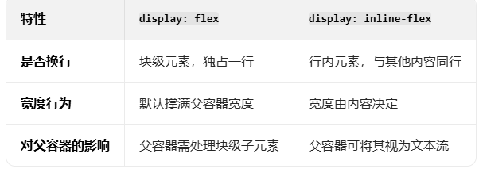

做一下 html css js 小练习

### 0618 drank-water:

small 标签，用来将文本显示为比周围文字更小的字号

在 `:root` 中定义的变量是全局变量，可在整个文档的任何 CSS 选择器中引用。

flex-wrap 用于控制 flex 容器内子元素如何换行

align-items: center; 在 flex 或 grid 布局中，控制子元素在交叉轴方向上的对齐方式

justify-content:center；在 flex 或 grid 布局中，控制子元素在主轴方向上的对齐方式

text-align：center; 控制块级元素内的**文本内容**或 **行内元素** （如 ``、`<a>`）的水平对齐方式。

`transition: 0.3s ease;` 是 CSS 中用于实现平滑动画效果的属性，它允许元素的属性值在一定时间内从一个状态过渡到另一个状态。

### 0619 drawing-app

`display: inline-flex;` 是 CSS 中一种混合显示模式，结合了 **内联元素（inline）** 和 **弹性容器（flex）** 的特性。

- **`1rem`** ：这里的 `rem` 是相对于根元素（也就是 `<html>` 元素）字体大小的单位。假设根元素的字体大小是默认的 `16px`，那么 `1rem` 就相当于 `16px`。

`margin-left: auto;`将元素的左侧外边距自动扩展，从而使元素在其父容器中实现特定的对齐效果。具体表现如下：

1. **水平居右** ：当与 `margin-right: 0;` 配合使用时，元素会被推至父容器的右侧。
2. **均分空间** ：如果同时设置 `margin-right: auto;`，元素会在父容器中水平居中（左右外边距平均分配剩余空间）。
3. **块级元素独占一行** ：对于行内元素或行内块元素，设置 `display: block;` 后，结合 `margin-left: auto;` 可使其独占一行并居右。
4. `ctx.beginPath()` - 开始一个新的路径
5. `ctx.moveTo(x1, y1)` - 将画笔移动到起点
6. `ctx.lineTo(x2, y2)` - 从起点绘制一条直线到终点
7. 设置线条样式：

   - `ctx.strokeStyle = color` - 线条颜色（这里的 `color`应该是函数外部定义的变量）
   - `ctx.lineWidth = size * 2` - 线条宽度（`size`也应该是外部变量）

8. `ctx.stroke()` - 实际绘制线条

### 0622 notes-app

`localStorage`是浏览器里的一种存储机制，它以键值对的形式将数据永久存储在浏览器中，除非手动删除。

因为 `localStorage`中存储的只能是字符串，所以在存储对象时，通常会先用 `JSON.stringify()`将对象转换为字符串。

`marked(value)` 是在调用 **Marked.js** 库，它的作用是将 **Markdown 格式的文本**转换为 **HTML 代码** 。

`outline: none;` 是 CSS 中用于移除元素获得焦点时默认显示的轮廓线（outline）的属性

### 0623 good cheap fast

- `id="cheap"`：为元素分配唯一标识符，用于与 `<label>`关联。
- `class="toggle"`：用于 CSS 选择器匹配，添加自定义样式。

**关联机制**

- `for="cheap"`：将标签与 `id="cheap"`的输入框绑定。
  → **点击标签时，会自动触发关联复选框的状态切换** 。
